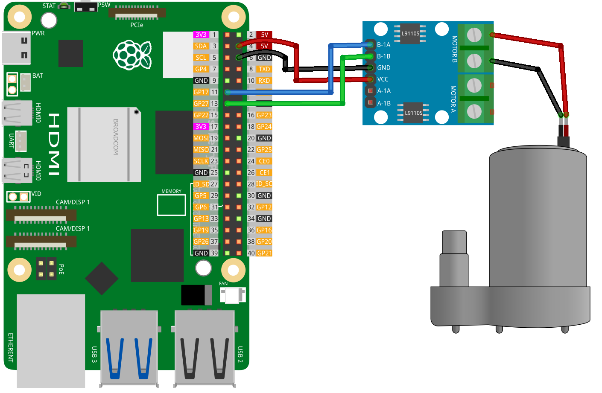

.. note:: 

    ¡Hola, bienvenido a la Comunidad de Entusiastas de SunFounder Raspberry Pi, Arduino y ESP32 en Facebook! Profundiza más en Raspberry Pi, Arduino y ESP32 con otros entusiastas.

    **¿Por qué unirte?**

    - **Soporte experto**: Resuelve problemas postventa y desafíos técnicos con la ayuda de nuestra comunidad y equipo.
    - **Aprender y compartir**: Intercambia consejos y tutoriales para mejorar tus habilidades.
    - **Preestrenos exclusivos**: Obtén acceso anticipado a nuevos anuncios de productos y adelantos.
    - **Descuentos especiales**: Disfruta de descuentos exclusivos en nuestros productos más nuevos.
    - **Promociones festivas y sorteos**: Participa en sorteos y promociones de temporada.

    👉 ¿Listo para explorar y crear con nosotros? Haz clic en [|link_sf_facebook|] y únete hoy mismo!

.. _pi_lesson31_pump:

Lección 31: Bomba centrífuga
==================================

En esta lección, aprenderás a controlar una bomba utilizando una Raspberry Pi. Aprenderás a escribir un script en Python para activar la bomba, controlar su velocidad y luego detenerla después de un tiempo determinado. Este proyecto proporciona una comprensión básica del control de bombas mediante la interfaz GPIO y programación en Python, lo que lo convierte en un punto de partida adecuado para principiantes interesados en Raspberry Pi y aplicaciones simples de bombas.

Componentes necesarios
--------------------------

En este proyecto, necesitamos los siguientes componentes. 

Es definitivamente conveniente comprar un kit completo, aquí tienes el enlace: 

.. list-table::
    :widths: 20 20 20
    :header-rows: 1

    *   - Nombre  
        - ELEMENTOS EN ESTE KIT  
        - ENLACE
    *   - Kit Sensor Universal Maker
        - 94
        - |link_umsk|

También puedes comprarlos por separado en los siguientes enlaces.

.. list-table::
    :widths: 30 20
    :header-rows: 1

    *   - Introducción del componente  
        - Enlace de compra

    *   - Raspberry Pi 5
        - |link_rpi5_buy|
    *   - :ref:`cpn_pump`
        - \-
    *   - :ref:`cpn_l9110`
        - \-

Cableado
---------------------------

Código
---------------------------

.. code-block:: python

   from gpiozero import Motor  
   from time import sleep  
   
   # Definir los pines de la bomba
   pump = Motor(forward=17, backward=27)  # Usando los números de pin GPIO de la Raspberry Pi
   
   # Activar la bomba
   pump.forward(speed=1)  # Establecer la velocidad de la bomba, el rango es de 0 a 1
   sleep(5)               # Ejecutar la bomba durante 5 segundos
   
   # Desactivar la bomba
   pump.stop()            # Detener la bomba

Análisis del código
---------------------------

#. Importar bibliotecas
   
   La biblioteca ``gpiozero`` se usa para controlar el motor, y la función ``sleep`` de la biblioteca ``time`` se utiliza para los retrasos.

   .. code-block:: python

      from gpiozero import Motor  
      from time import sleep  

#. Definir los pines de la bomba
   
   Se crea un objeto ``Motor`` con dos pines GPIO: uno para la operación hacia adelante y otro para la operación hacia atrás. En este caso, se utilizan los pines GPIO 17 y 27.

   .. code-block:: python

      pump = Motor(forward=17, backward=27)

#. Activar la bomba
   
   El motor se activa en la dirección hacia adelante con una velocidad especificada mediante ``pump.forward(speed=1)``. El parámetro de velocidad varía de 0 (detenido) a 1 (velocidad máxima). El motor funciona durante 5 segundos, como lo define ``sleep(5)``.

   .. code-block:: python

      pump.forward(speed=1)
      sleep(5)

#. Desactivar la bomba
   
   El motor se detiene usando ``pump.stop()``. Esto es esencial para detener de manera segura la operación del motor después del tiempo requerido.

   .. code-block:: python

      pump.stop()