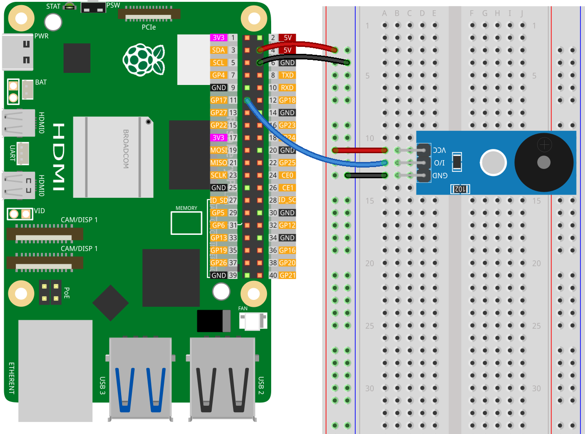

.. note:: 

    Ciao, benvenuto nella Comunità degli Appassionati di SunFounder Raspberry Pi & Arduino & ESP32 su Facebook! Approfondisci le tue conoscenze su Raspberry Pi, Arduino e ESP32 con altri appassionati.

    **Perché Unirsi?**

    - **Supporto Esperto**: Risolvi problemi post-vendita e sfide tecniche con l'aiuto della nostra comunità e del nostro team.
    - **Impara & Condividi**: Scambia consigli e tutorial per migliorare le tue competenze.
    - **Anteprime Esclusive**: Accedi in anteprima alle nuove annunci di prodotti e anteprime esclusive.
    - **Sconti Speciali**: Goditi sconti esclusivi sui nostri prodotti più recenti.
    - **Promozioni Festive e Giveaway**: Partecipa a giveaway e promozioni natalizie.

    👉 Pronto a esplorare e creare con noi? Clicca [|link_sf_facebook|] e unisciti oggi!

.. _pi_lesson32_passive_buzzer:

Lezione 32: Modulo Buzzer Passivo
==================================

In questa lezione imparerai a creare toni musicali utilizzando un TonalBuzzer con un Raspberry Pi. Imparerai a programmare il Raspberry Pi per riprodurre una sequenza di note musicali usando Python. La lezione include la definizione di una melodia come lista di note e durate, e la scrittura di una funzione per riprodurre queste note attraverso il buzzer. Questo progetto offre un'introduzione semplice al lavoro con l'output sonoro e alla programmazione Python, rendendolo una scelta pratica per i principianti interessati ad esplorare applicazioni musicali con il Raspberry Pi.

Componenti Necessari
--------------------------

Per questo progetto, abbiamo bisogno dei seguenti componenti.

È sicuramente conveniente acquistare un kit completo, ecco il link:

.. list-table::
    :widths: 20 20 20
    :header-rows: 1

    *   - Nome	
        - ARTICOLI IN QUESTO KIT
        - LINK
    *   - Universal Maker Sensor Kit
        - 94
        - |link_umsk|

Puoi anche acquistarli separatamente dai link sottostanti.

.. list-table::
    :widths: 30 20
    :header-rows: 1

    *   - Introduzione ai Componenti
        - Link Acquisto

    *   - Raspberry Pi 5
        - |link_rpi5_buy|
    *   - :ref:`cpn_buzzer`
        - |link_passive_buzzer_module_buy|
    *   - :ref:`cpn_breadboard`
        - |link_breadboard_buy|

Cablaggio
---------------------------

Codice
---------------------------

.. code-block:: python

   from gpiozero import TonalBuzzer
   from time import sleep

   # Inizializzare il TonalBuzzer sul pin GPIO 17
   tb = TonalBuzzer(17)  # Cambiare con il numero di pin a cui è collegato il buzzer

   def play(tune):
      """
      Play a musical tune using the buzzer.
      :param tune: List of tuples, where each tuple contains a note and its duration.
      """
      for note, duration in tune:
         print(note)  # Stampa la nota attuale in riproduzione
         tb.play(note)  # Riproduci la nota sul buzzer
         sleep(float(duration))  # Attendi la durata della nota
      tb.stop()  # Fermare il buzzer dopo aver riprodotto la melodia

   # Definire la melodia musicale come lista di note e loro durate
   tune = [('C#4', 0.2), ('D4', 0.2), (None, 0.2),
      ('Eb4', 0.2), ('E4', 0.2), (None, 0.6),
      ('F#4', 0.2), ('G4', 0.2), (None, 0.6),
      ('Eb4', 0.2), ('E4', 0.2), (None, 0.2),
      ('F#4', 0.2), ('G4', 0.2), (None, 0.2),
      ('C4', 0.2), ('B4', 0.2), (None, 0.2),
      ('F#4', 0.2), ('G4', 0.2), (None, 0.2),
      ('B4', 0.2), ('Bb4', 0.5), (None, 0.6),
      ('A4', 0.2), ('G4', 0.2), ('E4', 0.2),
      ('D4', 0.2), ('E4', 0.2)]

   # Riprodurre la melodia
   play(tune) 

Analisi del Codice
---------------------------

#. Importare le Librerie
   
   Importare ``TonalBuzzer`` da ``gpiozero`` per la generazione di suoni e ``sleep`` da ``time`` per il controllo dei tempi.

   .. code-block:: python

      from gpiozero import TonalBuzzer
      from time import sleep

#. Inizializzare il TonalBuzzer
   
   Creare un oggetto ``TonalBuzzer`` collegato al pin GPIO 17.

   .. code-block:: python

      tb = TonalBuzzer(17)

#. Definire la Funzione di Riproduzione
   
   La funzione ``play`` prende una lista di tuple come input, dove ogni tupla rappresenta una nota musicale e la sua durata. Itera attraverso ogni tupla, riproducendo la nota e attendendo la sua durata.

   .. code-block:: python

      def play(tune):
          for note, duration in tune:
              print(note)
              tb.play(note)
              sleep(float(duration))
          tb.stop()

#. Definire la Melodia
   
   La melodia è definita come una lista di tuple. Ogni tupla contiene una nota e la sua durata in secondi. ``None`` è usato per rappresentare una pausa.

   .. code-block:: python

      tune = [('C#4', 0.2), ('D4', 0.2), (None, 0.2), ...]

#. Riprodurre la Melodia
   
   La funzione ``play`` è chiamata con la lista ``tune``, facendo suonare il buzzer la sequenza di note definita.

   .. code-block:: python

      play(tune) 