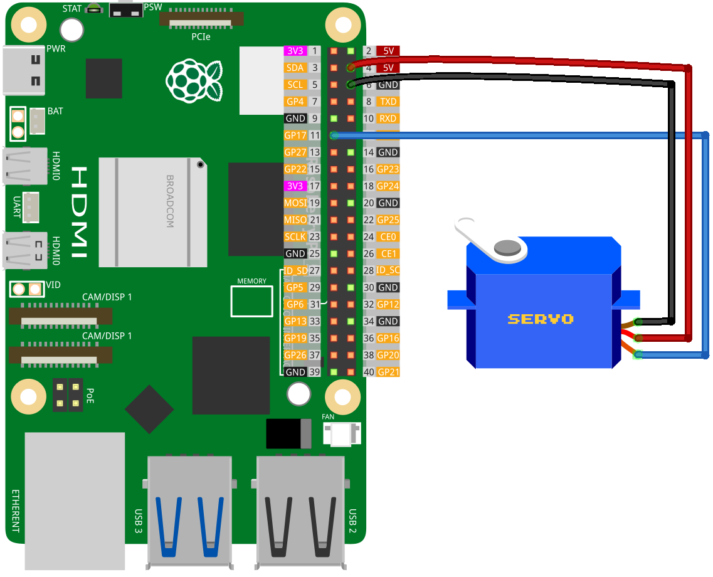

.. note:: 

    Ciao, benvenuto nella Comunità degli Appassionati di SunFounder Raspberry Pi & Arduino & ESP32 su Facebook! Approfondisci le tue conoscenze su Raspberry Pi, Arduino e ESP32 con altri appassionati.

    **Perché Unirsi?**

    - **Supporto Esperto**: Risolvi problemi post-vendita e sfide tecniche con l'aiuto della nostra comunità e del nostro team.
    - **Impara & Condividi**: Scambia consigli e tutorial per migliorare le tue competenze.
    - **Anteprime Esclusive**: Accedi in anteprima alle nuove annunci di prodotti e anteprime esclusive.
    - **Sconti Speciali**: Goditi sconti esclusivi sui nostri prodotti più recenti.
    - **Promozioni Festive e Giveaway**: Partecipa a giveaway e promozioni natalizie.

    👉 Pronto a esplorare e creare con noi? Clicca [|link_sf_facebook|] e unisciti oggi!

.. _pi_lesson33_servo:

Lezione 33: Motore Servo (SG90)
==================================

In questa lezione, imparerai a controllare un motore servo utilizzando un Raspberry Pi. Scoprirai come regolare le impostazioni di larghezza degli impulsi del servo per un controllo preciso e come scrivere uno script Python per muovere il servo in diverse posizioni: minima, media e massima.

Componenti Necessari
--------------------------

Per questo progetto, abbiamo bisogno dei seguenti componenti.

È sicuramente conveniente acquistare un kit completo, ecco il link:

.. list-table::
    :widths: 20 20 20
    :header-rows: 1

    *   - Nome	
        - ARTICOLI IN QUESTO KIT
        - LINK
    *   - Universal Maker Sensor Kit
        - 94
        - |link_umsk|

Puoi anche acquistarli separatamente dai link sottostanti.

.. list-table::
    :widths: 30 20
    :header-rows: 1

    *   - Introduzione ai Componenti
        - Link Acquisto

    *   - Raspberry Pi 5
        - |link_rpi5_buy|
    *   - :ref:`cpn_servo`
        - |link_servo_buy|

Cablaggio
---------------------------

Codice
---------------------------

.. code-block:: python

   from gpiozero import Servo
   from time import sleep
   
   # Pin GPIO per il servo
   myGPIO = 17
   
   # Fattore di correzione per il servo
   myCorrection = 0.45
   maxPW = (2.0 + myCorrection) / 1000  # Larghezza massima dell'impulso
   minPW = (1.0 - myCorrection) / 1000  # Larghezza minima dell'impulso
   
   # Inizializza il servo con un intervallo di larghezza d'impulso regolato
   servo = Servo(myGPIO, min_pulse_width=minPW, max_pulse_width=maxPW)
   
   # Muove continuamente il servo tra le posizioni
   while True:
      # Muove il servo in posizione media
      servo.mid()
      print("mid")
      sleep(0.5)

      # Muove il servo in posizione minima
      servo.min()
      print("min")
      sleep(1)

      # Muove il servo in posizione media
      servo.mid()
      print("mid")
      sleep(0.5)

      # Muove il servo in posizione massima
      servo.max()
      print("max")
      sleep(1)

Analisi del Codice
---------------------------

#. Importare le Librerie
   
   Importa la classe ``Servo`` da ``gpiozero`` per il controllo del servo e ``sleep`` da ``time`` per il controllo del tempo.

   .. code-block:: python

      from gpiozero import Servo
      from time import sleep

#. Pin GPIO e Fattore di Correzione del Servo
   
   Definisci il pin GPIO collegato al servo e imposta un fattore di correzione per calibrare l'intervallo di larghezza d'impulso del servo.

   .. code-block:: python

      myGPIO = 17
      myCorrection = 0.45
      maxPW = (2.0 + myCorrection) / 1000
      minPW = (1.0 - myCorrection) / 1000

#. Inizializzare il Servo
   
   Crea un oggetto ``Servo`` con il pin GPIO specificato e l'intervallo di larghezza d'impulso regolato.

   .. code-block:: python

      servo = Servo(myGPIO, min_pulse_width=minPW, max_pulse_width=maxPW)

#. Muovere il Servo Continuamente
   
   Usa un ciclo ``while True`` per muovere il servo tra le sue posizioni minima, media e massima, stampando la posizione corrente e facendo pause tra un movimento e l'altro.

   .. code-block:: python

      while True:
          servo.mid()
          print("mid")
          sleep(0.5)

          servo.min()
          print("min")
          sleep(1)

          servo.mid()
          print("mid")
          sleep(0.5)

          servo.max()
          print("max")
          sleep(1)