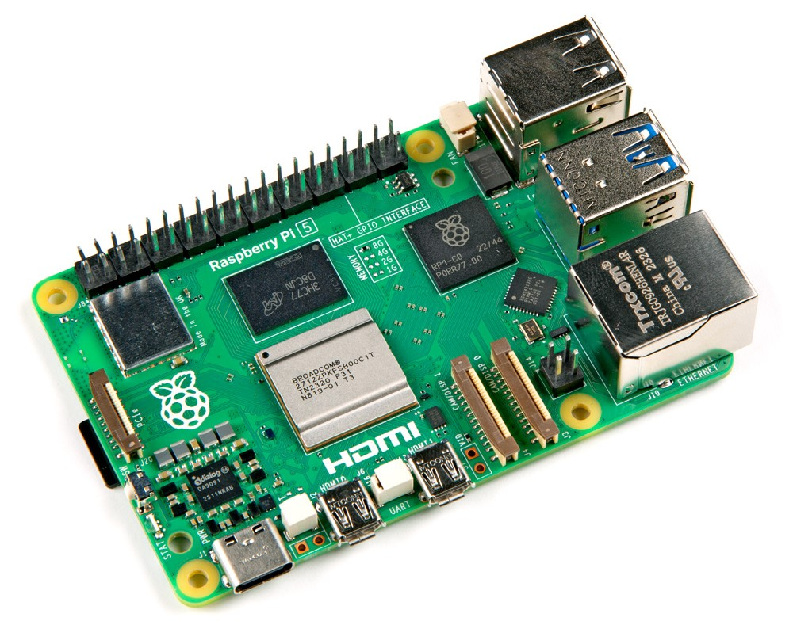

.. note:: 

    Bonjour et bienvenue dans la communauté des passionnés de Raspberry Pi, Arduino et ESP32 de SunFounder sur Facebook ! Plongez plus profondément dans l'univers de Raspberry Pi, Arduino et ESP32 avec d'autres passionnés.

    **Pourquoi nous rejoindre ?**

    - **Support d'experts** : Résolvez vos problèmes après-vente et vos défis techniques grâce à l'aide de notre communauté et de notre équipe.
    - **Apprendre et partager** : Échangez des astuces et des tutoriels pour améliorer vos compétences.
    - **Aperçus exclusifs** : Accédez en avant-première aux annonces de nouveaux produits et aux aperçus.
    - **Réductions spéciales** : Profitez de réductions exclusives sur nos produits les plus récents.
    - **Promotions festives et concours** : Participez à des concours et promotions pendant les fêtes.

    👉 Prêt à explorer et créer avec nous ? Cliquez sur [|link_sf_facebook|] et rejoignez-nous dès aujourd'hui !

.. _what_do_we_need:

De quoi avons-nous besoin ?
=============================

Composants nécessaires
-------------------------

**Raspberry Pi**

Le Raspberry Pi est un ordinateur à faible coût, de la taille d'une carte de crédit, qui se branche à un moniteur d'ordinateur ou à une télévision et s'utilise avec un clavier et une souris standards. C'est un dispositif polyvalent qui permet aux personnes de tous âges de découvrir l'informatique et d'apprendre des langages de programmation tels que Scratch et Python.

**Adaptateur secteur**

.. https://www.tablesgenerator.com/text_tables

+-----------------------------+-----------------------------------------------+
| Modèle                      | Alimentation recommandée (tension/courant)    |
+=============================+===============================================+
| Raspberry Pi 5              | 5V/5A, 5V/3A limite les périphériques à 600mA |
+-----------------------------+-----------------------------------------------+
| Raspberry Pi 4 Modèle B     | 5V/3A                                         |
+-----------------------------+-----------------------------------------------+
| Raspberry Pi 3 (tous modèles)| 5V/2.5A                                      |
+-----------------------------+-----------------------------------------------+

**Carte micro SD**

Votre Raspberry Pi a besoin d'une carte micro SD pour stocker tous ses fichiers et le système d'exploitation Raspberry Pi OS. Il vous faut une carte micro SD d'une capacité d'au moins 8 Go.

Composants optionnels
------------------------

**Écran**

Pour accéder à l'environnement de bureau du Raspberry Pi, vous pouvez le connecter à un téléviseur ou à un moniteur d'ordinateur. Si l'écran dispose de haut-parleurs, l'audio sera émis par ceux-ci.

**Souris et clavier**

Lorsque vous utilisez un écran, un clavier USB et une souris USB sont également nécessaires.

**HDMI**

Le Raspberry Pi possède des ports de sortie HDMI (ou Micro HDMI), compatibles avec les ports HDMI de la plupart des téléviseurs et moniteurs d'ordinateur modernes. Si votre écran ne possède qu'un port DVI ou VGA, vous devrez utiliser le câble adaptateur correspondant.

**Boîtier**

Vous pouvez placer votre Raspberry Pi dans un boîtier pour protéger votre appareil. Sur notre site officiel, nous proposons des produits liés à cela à la vente ; vous pouvez consulter ou acheter des boîtiers pour Raspberry Pi |link_buy_pi_case|.

**Son ou casque**

La plupart des modèles Raspberry Pi disposent d'un port audio 3,5 mm, qui peut être utilisé lorsque votre écran n'a pas de haut-parleurs intégrés ou n'est pas utilisé. Cependant, il est important de noter que le dernier modèle, le Raspberry Pi 5, ne dispose pas de port audio 3,5 mm.
