.. note:: 

    ¡Hola, bienvenido a la comunidad de entusiastas de Raspberry Pi, Arduino y ESP32 de SunFounder en Facebook! Profundiza en Raspberry Pi, Arduino y ESP32 con otros entusiastas.

    **¿Por qué unirse?**

    - **Soporte Experto**: Resuelve problemas post-venta y desafíos técnicos con la ayuda de nuestra comunidad y equipo.
    - **Aprende y Comparte**: Intercambia consejos y tutoriales para mejorar tus habilidades.
    - **Avances Exclusivos**: Obtén acceso anticipado a anuncios de nuevos productos y avances.
    - **Descuentos Especiales**: Disfruta de descuentos exclusivos en nuestros productos más nuevos.
    - **Promociones Festivas y Sorteos**: Participa en sorteos y promociones de temporada.

    👉 ¿Listo para explorar y crear con nosotros? Haz clic en [|link_sf_facebook|] y únete hoy mismo!

.. _install_os:

Escribir Raspberry Pi OS en la tarjeta SD
=============================================

**Paso 1**

El equipo de Raspberry Pi ofrece una herramienta gráfica fácil de usar para escribir en tarjetas SD, compatible con Mac OS, Ubuntu 18.04 y Windows. Esta es la opción más conveniente para la mayoría de los usuarios, ya que descarga e instala automáticamente la imagen del sistema operativo en la tarjeta SD.

Visita la página de descarga: https://www.raspberrypi.org/software/. Elige el **Raspberry Pi Imager** para tu sistema operativo. Una vez descargado, ábrelo para comenzar la instalación.

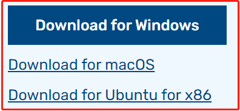

.. raw:: html

     

**Paso 2**

Al iniciar el instalador, es posible que tu sistema operativo muestre una advertencia de seguridad. Por ejemplo, Windows puede mostrar este mensaje:

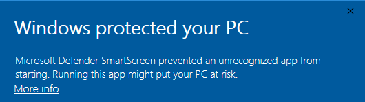

.. raw:: html

     

Si ves esta advertencia, haz clic en **More info** y luego selecciona **Run anyway**. Continúa siguiendo las instrucciones en la pantalla para completar la instalación del Raspberry Pi Imager.

**Paso 3**

Después de instalar el Imager, abre la aplicación haciendo clic en el icono de **Raspberry Pi Imager** o ejecutando ``rpi-imager``.

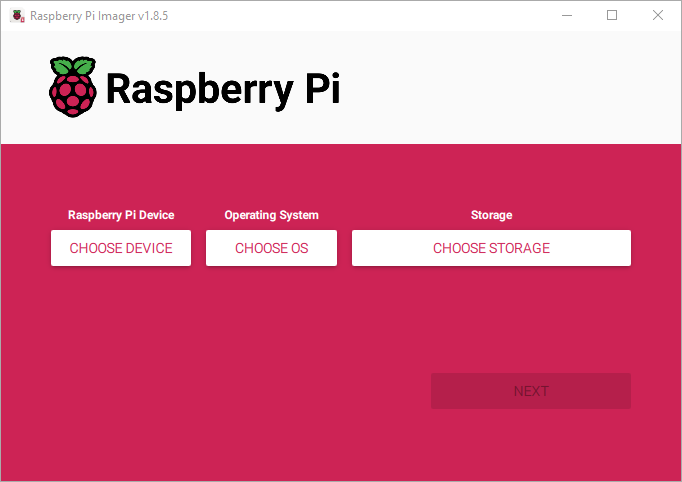

.. raw:: html

     

**Paso 4**

Haz clic en **Choose device** y selecciona tu modelo de Raspberry Pi de la lista.

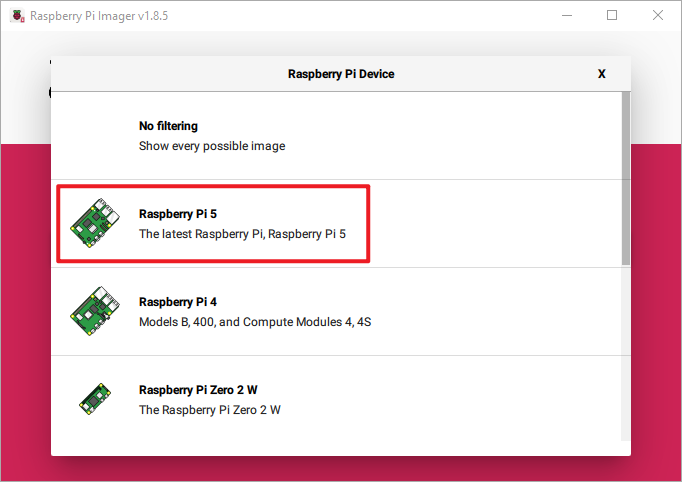

.. raw:: html

     

**Paso 5**

A continuación, haz clic en **Choose OS** y selecciona el sistema operativo que deseas instalar.

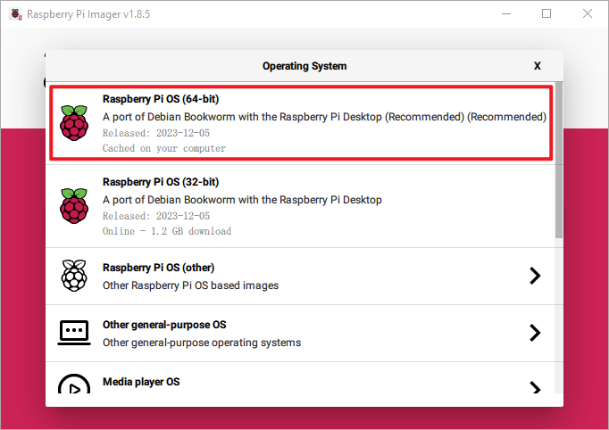

.. raw:: html

     

**Paso 6**

Inserta el medio de almacenamiento que prefieras, como una tarjeta microSD, en un lector de tarjetas SD externo o integrado. Luego, haz clic en "Elegir almacenamiento" y selecciona tu dispositivo.

.. note:: 

   **Asegúrate de seleccionar el dispositivo de almacenamiento correcto cuando haya varios dispositivos conectados**; generalmente, se pueden distinguir por su capacidad. Si tienes dudas, desconecta los otros dispositivos. **Ten en cuenta que la instalación del sistema en el dispositivo seleccionado borrará todos los datos en él.**

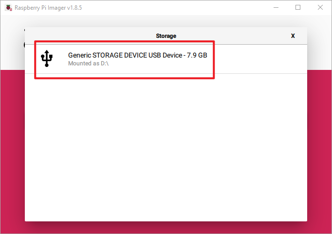

.. raw:: html

     

**Paso 7**

Haz clic en el botón **NEXT** y elige **EDIT SETTINGS** para acceder a la página de personalización del sistema operativo.

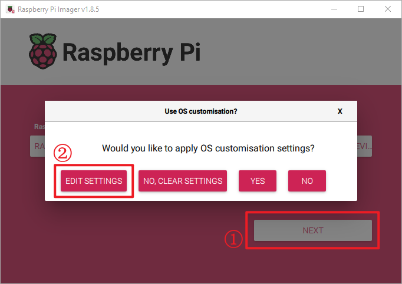

.. raw:: html

     

**Paso 8**

Configura el **hostname**.

.. note::

   La opción del nombre del host define el nombre con el que tu Raspberry Pi se identificará en la red usando mDNS. Al conectar tu Raspberry Pi a la red, permitirá que otros dispositivos interactúen con él utilizando ``<hostname>.local`` o ``<hostname>.lan``.

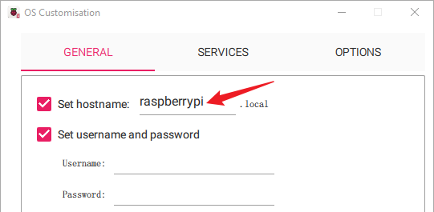

.. raw:: html

     

Configura el **username** y la **password** para la cuenta de administrador de la Raspberry Pi.

.. note::
   La Raspberry Pi no viene con una contraseña predeterminada, por lo que es crucial establecer una. Además, tienes la opción de personalizar el nombre de usuario.

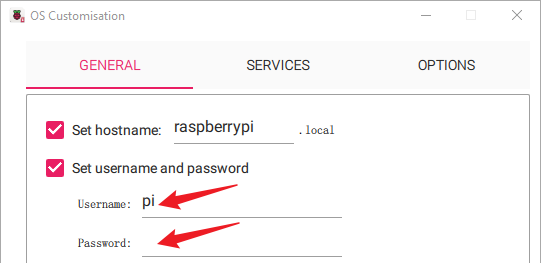

.. raw:: html

     

Configura la LAN inalámbrica ingresando el **SSID** y la **password** de tu red.

.. note::

   Configura el "país de la LAN inalámbrica" utilizando el código de dos letras de tu país |link_alpha2_code|.

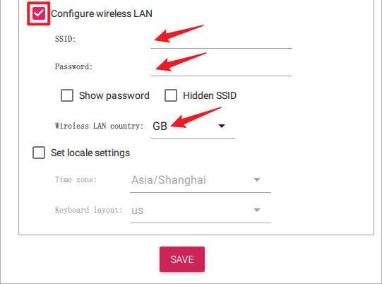

.. raw:: html

     

**Paso 9**

Dirígete a la página **SERVICES**, selecciona **Enable SSH option** para activar SSH y elige "Usar autenticación por contraseña" (recomendado para principiantes). Haz clic en **Save** para aplicar los cambios.

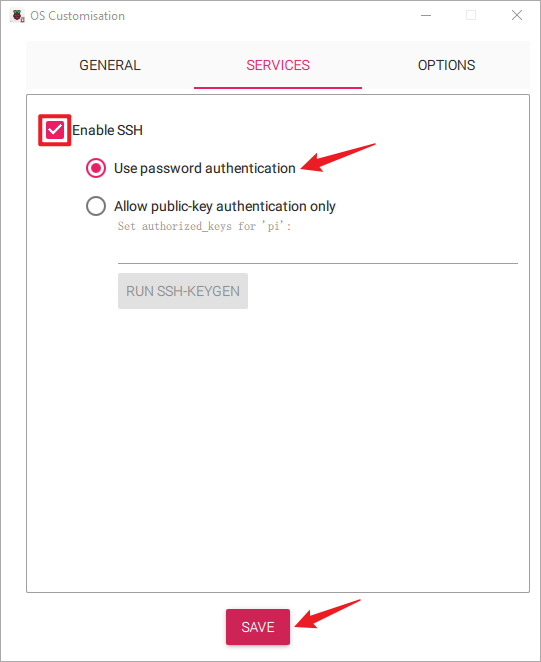

.. raw:: html

     

**Paso 10**

Haz clic en el botón **Yes**.

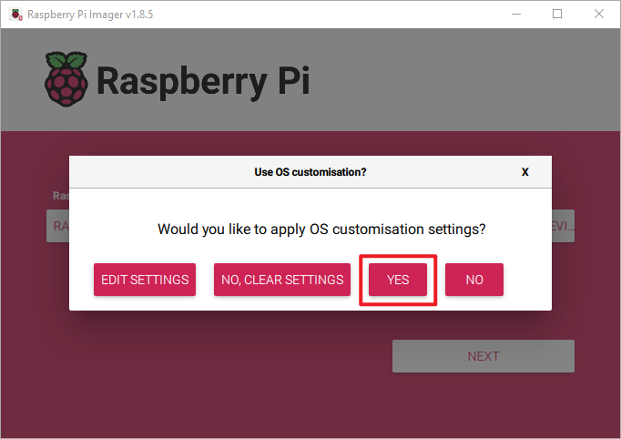

.. raw:: html

     

**Paso 11**

Si tu tarjeta SD contiene archivos, considera hacer una copia de seguridad para evitar la pérdida permanente. Si no necesitas hacer una copia de seguridad, haz clic en **Yes**.

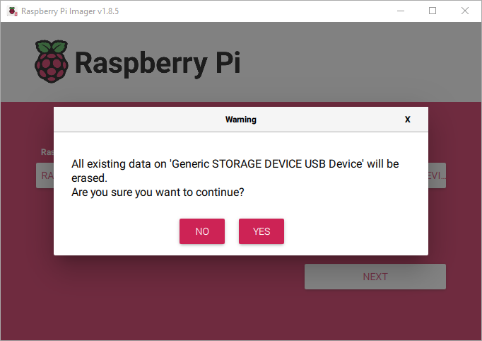

.. raw:: html

     

**Paso 12**

La ventana que aparece a continuación aparecerá una vez que el proceso de escritura haya finalizado. El proceso de escritura toma un tiempo y varía según el rendimiento de lectura y escritura de la tarjeta SD; por favor, ten paciencia.

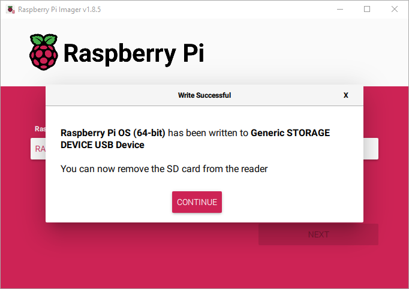

.. raw:: html

     

