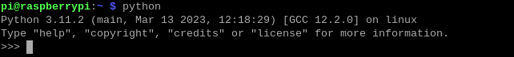
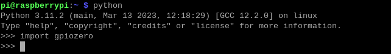
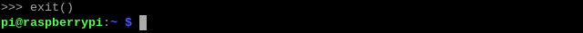

.. note:: 

    Bonjour et bienvenue dans la communauté des passionnés de Raspberry Pi, Arduino et ESP32 de SunFounder sur Facebook ! Explorez plus en profondeur le Raspberry Pi, Arduino et ESP32 avec d'autres passionnés.

    **Pourquoi nous rejoindre ?**

    - **Support d'experts** : Résolvez vos problèmes après-vente et défis techniques grâce à l'aide de notre communauté et de notre équipe.
    - **Apprendre et partager** : Échangez des astuces et des tutoriels pour améliorer vos compétences.
    - **Aperçus exclusifs** : Accédez en avant-première aux annonces de nouveaux produits et aperçus.
    - **Réductions spéciales** : Profitez de réductions exclusives sur nos produits les plus récents.
    - **Promotions festives et concours** : Participez à des concours et promotions lors des fêtes.

    👉 Prêt à explorer et créer avec nous ? Cliquez sur [|link_sf_facebook|] et rejoignez-nous dès aujourd'hui !

Vérifier ``GPIO Zero``
=============================

``GPIO Zero`` est un module permettant de contrôler les broches GPIO du Raspberry Pi. Ce package offre une série de classes et de fonctions conviviales pour manipuler les GPIO sur un Raspberry Pi. Pour des exemples et de la documentation, consultez : https://gpiozero.readthedocs.io/en/latest/.

La dernière version de Raspberry Pi OS inclut GPIO Zero par défaut. Pour vérifier son installation, ouvrez le Terminal et tapez :

.. code-block::

    python

Ensuite, tapez ``import gpiozero`` dans l'interface Python. Si aucune erreur n'apparaît, cela signifie que GPIO Zero est correctement installé.

.. code-block::

    import gpiozero

Si vous souhaitez quitter l'interface Python, tapez :

.. code-block::

    exit()

