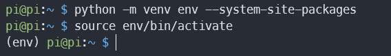
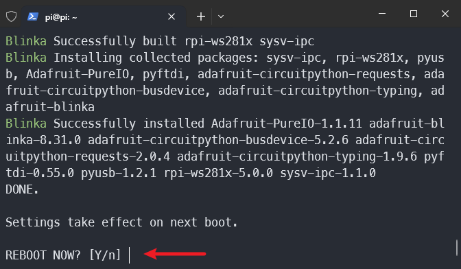
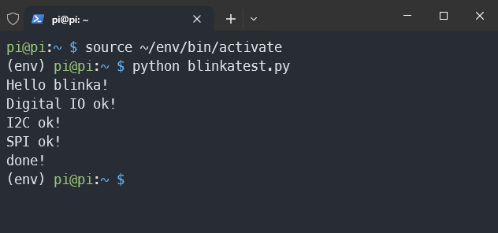

.. note:: 

    Bonjour et bienvenue dans la communauté des passionnés de Raspberry Pi, Arduino et ESP32 de SunFounder sur Facebook ! Explorez plus en profondeur le Raspberry Pi, Arduino et ESP32 avec d'autres passionnés.

    **Pourquoi nous rejoindre ?**

    - **Support d'experts** : Résolvez vos problèmes après-vente et défis techniques grâce à l'aide de notre communauté et de notre équipe.
    - **Apprendre et partager** : Échangez des astuces et des tutoriels pour améliorer vos compétences.
    - **Aperçus exclusifs** : Accédez en avant-première aux annonces de nouveaux produits et aperçus.
    - **Réductions spéciales** : Profitez de réductions exclusives sur nos produits les plus récents.
    - **Promotions festives et concours** : Participez à des concours et promotions lors des fêtes.

    👉 Prêt à explorer et créer avec nous ? Cliquez sur [|link_sf_facebook|] et rejoignez-nous dès aujourd'hui !

.. _install_blinka:

Installer ``Adafruit_Blinka`` (CircuitPython) - Optionnel
==============================================================

Pour une expérience améliorée avec des modules avancés, nous recommandons d'utiliser la bibliothèque ``Adafruit_Blinka``, un composant clé de l'environnement CircuitPython. La particularité de Blinka est sa capacité à permettre l'exécution de code écrit pour CircuitPython de manière fluide et sans effort sur des ordinateurs Linux comme le Raspberry Pi.

Cette bibliothèque simplifie l'utilisation de modules complexes tels que BMP280, VL53L0X et OLED, facilitant ainsi le développement de vos projets. Avec CircuitPython, la programmation devient plus accessible, vous permettant de vous concentrer sur la création d'applications robustes sans avoir besoin de connaissances approfondies en matériel.

De plus, vous bénéficierez d'une grande communauté de support et de nombreuses ressources pour vous aider dans votre apprentissage et développement.

Nous vous guiderons à travers le processus simple d'installation de Adafruit_Blinka, afin que vous puissiez rapidement commencer à travailler sur vos projets.

Mettre à jour votre Raspberry Pi et Python
----------------------------------------------

Avant d'installer Blinka, veuillez utiliser les commandes suivantes pour vous assurer que votre Raspberry Pi et votre version de Python sont à jour :

.. code-block:: bash

   sudo apt-get update
   sudo apt-get upgrade

Configurer un environnement virtuel
--------------------------------------

À partir de la version Bookworm de l'OS, les packages installés via ``pip`` doivent être installés dans un environnement Python virtuel utilisant ``venv``. Un environnement virtuel est un conteneur sécurisé où vous pouvez installer des modules tiers sans affecter ni perturber le Python de votre système.

La commande suivante créera un répertoire "env" dans votre répertoire utilisateur (``~``) pour l'environnement virtuel Python.

.. code-block:: bash
   
   cd ~
   python -m venv env --system-site-packages

Vous devrez activer l'environnement virtuel à chaque redémarrage du Pi. Pour l'activer :

.. code-block:: bash

   source env/bin/activate

Vous verrez que votre invite de commande sera maintenant précédée de (env), ce qui indique que vous n'utilisez plus le Python du système, mais plutôt la version de Python contenue dans votre environnement virtuel. Les modifications que vous apportez ici ne causeront pas de problèmes à votre Python système, de même que les nouveaux modules installés dans votre environnement.

Pour désactiver, vous pouvez utiliser ``deactivate``, mais laissez-le activé pour l'instant.

Installation automatique
----------------------------

Une fois l'environnement virtuel activé (vous verrez ``(env)`` au début de la commande du terminal), exécutez le code suivant dans cet ordre. Ce code exécutera le script d'installation fourni par Adafruit et complétera automatiquement les étapes restantes de l'installation.

.. code-block:: bash

   pip3 install --upgrade adafruit-python-shell
   pip3 install rpi-lgpio
   wget https://raw.githubusercontent.com/adafruit/Raspberry-Pi-Installer-Scripts/master/raspi-blinka.py
   sudo -E env PATH=$PATH python3 raspi-blinka.py

Cela peut prendre quelques minutes pour s'exécuter. Lorsque cela sera terminé, il vous demandera si vous souhaitez redémarrer. Appuyez directement sur Entrée pour redémarrer, ou si vous souhaitez redémarrer plus tard, entrez "n" puis appuyez sur Entrée. Lorsque vous êtes prêt, redémarrez manuellement votre Raspberry Pi.

Une fois le redémarrage effectué, la connexion se fermera. Après quelques minutes, vous pourrez vous reconnecter.

Test Blinka
-----------------------

Créez un nouveau fichier appelé ``blinkatest.py`` avec nano ou votre éditeur de texte préféré et ajoutez le code suivant :

.. code-block:: python

   import board
   import digitalio
   import busio
   
   print("Hello blinka!")
   
   # Essayer de créer une entrée numérique
   pin = digitalio.DigitalInOut(board.17)
   print("Digital IO ok!")
   
   # Essayer de créer un périphérique I2C
   i2c = busio.I2C(board.SCL, board.SDA)
   print("I2C ok!")
   
   # Essayer de créer un périphérique SPI
   spi = busio.SPI(board.SCLK, board.MOSI, board.MISO)
   print("SPI ok!")
   
   print("done!")

Avant d'exécuter le code, assurez-vous que vous avez activé l'environnement virtuel Python avec Blinka installé :

.. code-block:: bash

   source ~/env/bin/activate

Ensuite, exécutez la commande suivante dans la ligne de commande :

.. code-block:: bash

   python blinkatest.py

Vous devriez voir le message suivant, indiquant que les entrées/sorties numériques, I2C et SPI ont toutes fonctionné.

Références
-----------------------

- |link_adafruit_blinka_guide|

- |link_python_on_raspberry_pi|
