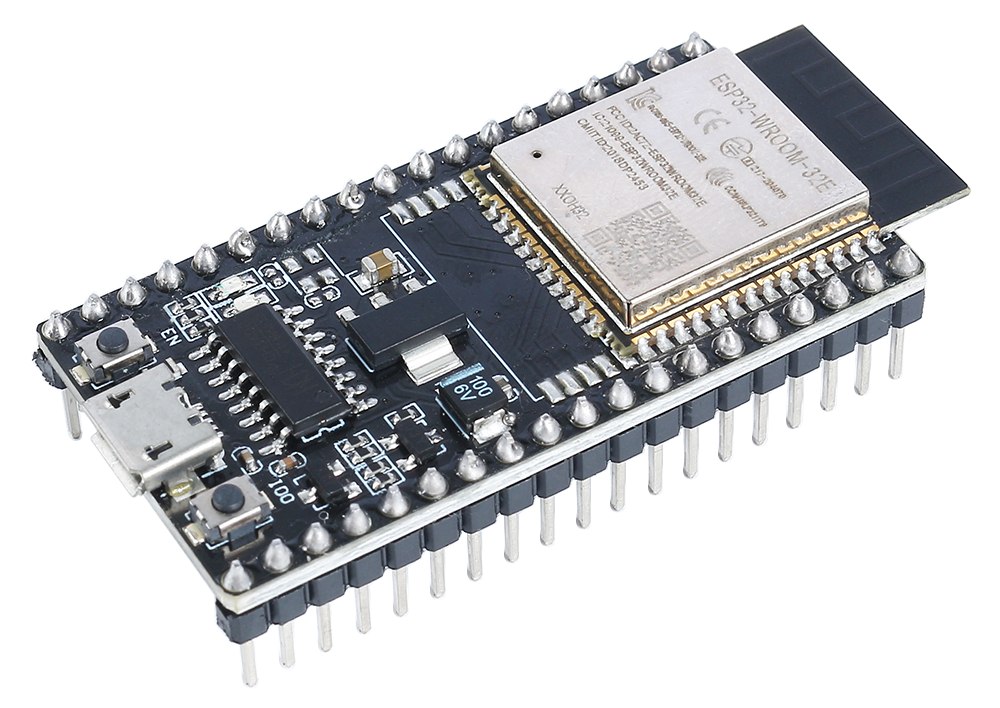
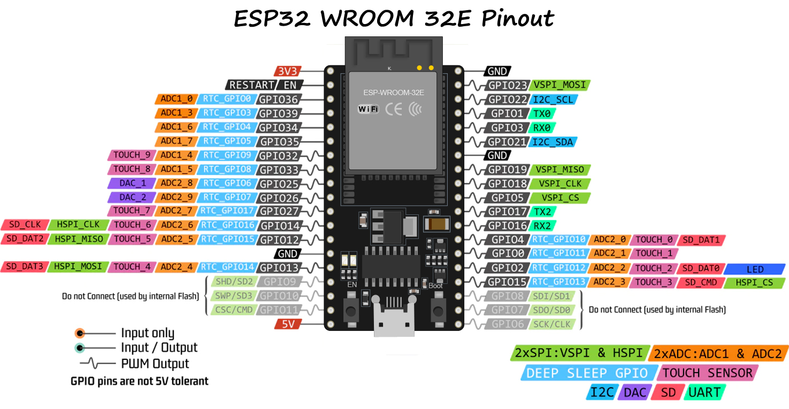
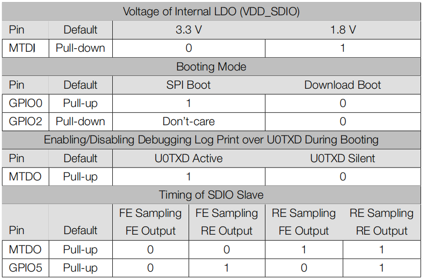

.. note:: 

   Ciao, benvenuti nella Community di appassionati di SunFounder Raspberry Pi, Arduino & ESP32 su Facebook! Approfondisci la tua conoscenza su Raspberry Pi, Arduino e ESP32 insieme ad altri appassionati.

   **Perché unirsi?**

   - **Supporto Esperto**: Risolvi problemi post-vendita e sfide tecniche con l'aiuto della nostra community e del nostro team.
   - **Impara e Condividi**: Scambia consigli e tutorial per migliorare le tue competenze.
   - **Anteprime Esclusive**: Accedi in anteprima alle nuove annunci di prodotti e anteprime.
   - **Sconti Speciali**: Goditi sconti esclusivi sui nostri prodotti più recenti.
   - **Promozioni Festive e Giveaway**: Partecipa ai giveaway e alle promozioni festive.

   👉 Pronto per esplorare e creare con noi? Clicca [|link_sf_facebook|] e unisciti oggi!

.. _cpn_esp32_wroom_32e:

ESP32 WROOM 32E
===================

L'ESP32 WROOM-32E è un modulo versatile e potente basato sul chipset ESP32 di Espressif. Offre elaborazione dual-core, connettività Wi-Fi e Bluetooth integrate e vanta un'ampia gamma di interfacce periferiche. Nota per il suo basso consumo energetico, il modulo è ideale per applicazioni IoT, consentendo connettività intelligente e prestazioni robuste in formati compatti.

Le caratteristiche principali includono:

* **Potenza di Elaborazione**: È dotato di un microprocessore dual-core Xtensa® LX6 a 32 bit, offrendo scalabilità e flessibilità.
* **Capacità Wireless**: Con Wi-Fi integrato a 2,4 GHz e Bluetooth dual-mode, è perfettamente adatto per applicazioni che richiedono una comunicazione wireless stabile.
* **Memoria e Archiviazione**: Dispone di ampio SRAM e memoria flash ad alte prestazioni, soddisfando le esigenze di memorizzazione di programmi utente e dati.
* **GPIO**: Offrendo fino a 38 pin GPIO, supporta una varietà di dispositivi esterni e sensori.
* **Consumo Energetico Ridotto**: Sono disponibili molteplici modalità di risparmio energetico, rendendolo ideale per scenari alimentati a batteria o efficienti dal punto di vista energetico.
* **Sicurezza**: Le funzionalità integrate di crittografia e sicurezza garantiscono che i dati e la privacy degli utenti siano ben protetti.
* **Versatilità**: Dalle semplici apparecchiature domestiche alle complesse macchine industriali, il WROOM-32E offre prestazioni consistenti ed efficienti.

In sintesi, l'ESP32 WROOM-32E non solo offre capacità di elaborazione robuste e diverse opzioni di connettività, ma vanta anche una serie di funzionalità che lo rendono la scelta preferita nei settori IoT e dispositivi intelligenti.

* |link_esp32_datasheet|

.. _esp32_pinout:

Schema dei Pin
-------------------------

L'ESP32 presenta alcune limitazioni nell'uso dei pin a causa della condivisione di certe funzionalità su determinati pin. Quando si progetta un progetto, è buona pratica pianificare attentamente l'uso dei pin e verificare eventuali conflitti per garantire il corretto funzionamento ed evitare problemi.

Ecco alcune delle principali restrizioni e considerazioni:

* **ADC1 e ADC2**: ADC2 non può essere utilizzato quando il WiFi o il Bluetooth sono attivi. Tuttavia, ADC1 può essere utilizzato senza restrizioni.
* **Pin di Bootstrap**: GPIO0, GPIO2, GPIO5, GPIO12 e GPIO15 sono utilizzati per il bootstrap durante il processo di avvio. Si dovrebbe fare attenzione a non collegare componenti esterni che potrebbero interferire con il processo di avvio su questi pin.
* **Pin JTAG**: GPIO12, GPIO13, GPIO14 e GPIO15 possono essere utilizzati come pin JTAG per scopi di debug. Se il debug JTAG non è richiesto, questi pin possono essere utilizzati come GPIO regolari.
* **Pin Touch**: Alcuni pin supportano funzionalità touch. Questi pin dovrebbero essere utilizzati con cautela se si intende utilizzarli per il rilevamento touch.
* **Pin di Alimentazione**: Alcuni pin sono riservati per funzioni legate all'alimentazione e dovrebbero essere utilizzati di conseguenza. Ad esempio, evitare di prelevare corrente eccessiva dai pin di alimentazione come 3V3 e GND.
* **Pin Solo Input**: Alcuni pin sono solo di input e non dovrebbero essere utilizzati come output.

.. _esp32_strapping:

Pin di Strapping
--------------------------

L'ESP32 ha cinque pin di strapping:

.. list-table::
   :widths: 5 15
   :header-rows: 1

   *   - Pin di Strapping
       - Descrizione
   *   - IO5
       - Predefinito a pull-up, il livello di tensione di IO5 e IO15 influisce sulla temporizzazione di SDIO Slave.
   *   - IO0
       - Predefinito a pull-up, se tirato a terra, entra in modalità di download.
   *   - IO2
       - Predefinito a pull-down, IO0 e IO2 faranno entrare l'ESP32 in modalità di download.
   *   - IO12(MTDI)
       - Predefinito a pull-down, se tirato in alto, l'ESP32 non si avvierà normalmente.
   *   - IO15(MTDO)
       - Predefinito a pull-up, se tirato a terra, il log di debug non sarà visibile. Inoltre, il livello di tensione di IO5 e IO15 influisce sulla temporizzazione di SDIO Slave.

Il software può leggere i valori di questi cinque bit dal registro "GPIO_STRAPPING". Durante il rilascio del reset del sistema del chip (power-on-reset, reset del watchdog RTC e reset per calo di tensione), i latch dei pin di strapping campionano il livello di tensione come bit di strapping di "0" o "1" e mantengono questi bit fino a quando il chip non viene alimentato o spento. I bit di strapping configurano la modalità di avvio del dispositivo, la tensione operativa di VDD_SDIO e altre impostazioni iniziali del sistema.

Ogni pin di strapping è collegato al suo pull-up/pull-down interno durante il reset del chip. Di conseguenza, se un pin di strapping non è collegato o il circuito esterno collegato è ad alta impedenza, il pull-up/pull-down interno debole determinerà il livello di ingresso predefinito dei pin di strapping.

Per modificare i valori dei bit di strapping, gli utenti possono applicare le resistenze esterne di pull-down/pull-up, o utilizzare i GPIO del MCU ospite per controllare il livello di tensione di questi pin all'accensione dell'ESP32.

Dopo il rilascio del reset, i pin di strapping funzionano come pin di funzione normale.
Consulta la seguente tabella per una configurazione dettagliata della modalità di avvio tramite pin di strapping.

* FE: flanco di discesa, RE: flanco di salita
* Il firmware può configurare i bit del registro per modificare le impostazioni di "Tensione dell'LDO interno (VDD_SDIO)" e "Temporizzazione di SDIO Slave", dopo l'avvio.
* Il modulo integra un flash SPI da 3,3 V, quindi il pin MTDI non può essere impostato su 1 quando il modulo è alimentato.