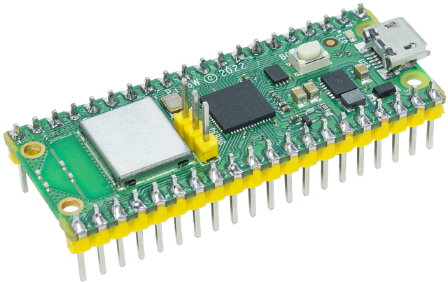
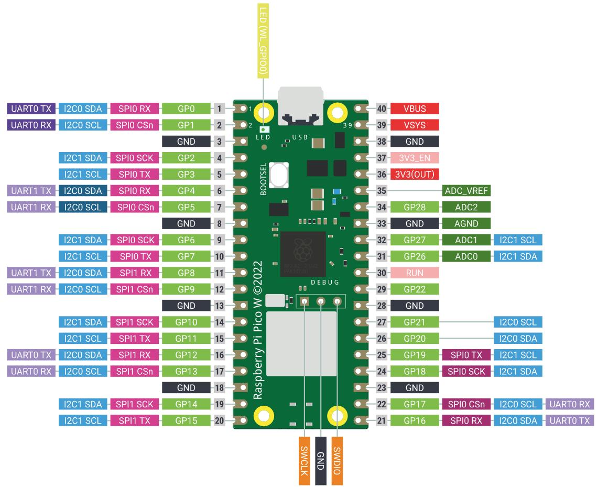

.. note:: 

    ¡Hola, bienvenido a la Comunidad de Entusiastas de SunFounder Raspberry Pi, Arduino y ESP32 en Facebook! Profundiza más en Raspberry Pi, Arduino y ESP32 junto con otros entusiastas.

    **¿Por qué unirte?**

    - **Soporte experto**: Resuelve problemas postventa y desafíos técnicos con la ayuda de nuestra comunidad y equipo.
    - **Aprender y compartir**: Intercambia consejos y tutoriales para mejorar tus habilidades.
    - **Preestrenos exclusivos**: Obtén acceso anticipado a nuevos anuncios de productos y adelantos.
    - **Descuentos especiales**: Disfruta de descuentos exclusivos en nuestros productos más recientes.
    - **Promociones festivas y sorteos**: Participa en sorteos y promociones de temporada.

    👉 ¿Listo para explorar y crear con nosotros? Haz clic en [|link_sf_facebook|] y únete hoy mismo!

.. _cpn_pico_w:

Raspberry Pi Pico W
=======================================

Raspberry Pi Pico W trae conectividad inalámbrica a la línea de productos más vendidos Raspberry Pi Pico. Construido alrededor de nuestra plataforma de silicio RP2040, los productos Pico aportan nuestros valores característicos de alto rendimiento, bajo costo y facilidad de uso al espacio de los microcontroladores.

Raspberry Pi Pico W ofrece soporte para LAN inalámbrica 802.11 b/g/n de 2.4 GHz, con una antena incorporada y certificación de cumplimiento modular. Es capaz de operar en modos de estación y punto de acceso. El acceso completo a la funcionalidad de la red está disponible tanto para desarrolladores de C como de MicroPython.

Raspberry Pi Pico W combina el RP2040 con 2 MB de memoria flash y un chip de suministro de energía que admite voltajes de entrada de 1.8 a 5.5V. Ofrece 26 pines GPIO, tres de los cuales pueden funcionar como entradas analógicas, en pads de orificio pasante de 0.1” de paso con bordes estriados.
Raspberry Pi Pico W está disponible como una unidad individual o en bobinas de 480 unidades para montaje automatizado.

Características
------------------

* Formato de 21 mm x 51 mm
* Microcontrolador RP2040 diseñado por Raspberry Pi en el Reino Unido
* Procesador de doble núcleo Arm Cortex-M0+, con reloj flexible que alcanza hasta 133 MHz
* 264 kB de SRAM en el chip
* 2 MB de flash QSPI a bordo
* LAN inalámbrica 802.11n de 2.4 GHz
* 26 pines GPIO multifuncionales, incluyendo 3 entradas analógicas
* 2 x UART, 2 x controladores SPI, 2 x controladores I2C, 16 x canales PWM
* 1 x controlador USB 1.1 y PHY, con soporte para host y dispositivo
* 8 x máquinas de estado PIO programables para soporte de periféricos personalizados
* Potencia de entrada soportada de 1.8-5.5V DC
* Temperatura de operación de -20°C a +70°C
* Módulo estriado que permite la soldadura directa a las placas portadoras
* Programación por arrastrar y soltar usando almacenamiento masivo a través de USB
* Modos de bajo consumo, de sueño y en reposo
* Reloj preciso en el chip
* Sensor de temperatura
* Bibliotecas de enteros y punto flotante aceleradas en el chip

Pines del Pico
----------------

.. raw:: html

     

.. list-table:: 
    :widths: 3 5 10
    :header-rows: 1

    *   - Nombre
        - Descripción
        - Función
    *   - GP0-GP28
        - Pines de entrada/salida de propósito general
        - Actúan como entrada o salida sin un propósito fijo
    *   - GND
        - Tierra 0 voltios
        - Varios pines GND alrededor del Pico W para facilitar el cableado.
    *   - RUN
        - Habilita o deshabilita tu Pico
        - Inicia y detiene tu Pico W desde otro microcontrolador.
    *   - GPxx_ADCx
        - Entrada/salida de propósito general o entrada analógica
        - Usado como entrada analógica y como entrada o salida digital, pero no ambos al mismo tiempo.
    *   - ADC_VREF
        - Referencia de voltaje del convertidor analógico a digital (ADC)
        - Un pin especial que establece un voltaje de referencia para cualquier entrada analógica.
    *   - AGND
        - Tierra 0 voltios del convertidor analógico a digital (ADC)
        - Una conexión de tierra especial para el pin ADC_VREF.
    *   - 3V3(O)
        - Alimentación de 3.3 voltios
        - Una fuente de alimentación de 3.3V, el mismo voltaje con el que funciona internamente tu Pico W, generado a partir de la entrada VSYS.
    *   - 3V3(E)
        - Habilita o deshabilita la alimentación
        - Enciende o apaga la alimentación de 3V3(O), también puede apagar tu Pico W.
    *   - VSYS
        - Alimentación de 2-5 voltios
        - Un pin directamente conectado a la fuente de alimentación interna de tu Pico, que no puede apagarse sin también apagar el Pico W.
    *   - VBUS
        - Alimentación de 5 voltios
        - Una fuente de alimentación de 5 V tomada del puerto micro USB de tu Pico, utilizada para alimentar hardware que necesite más de 3.3 V.

El mejor lugar para encontrar todo lo que necesitas para comenzar con tu Raspberry Pi Pico W es `aquí <https://www.raspberrypi.com/documentation/microcontrollers/raspberry-pi-pico.html>`_.

O puedes hacer clic en los siguientes enlaces:

* `Resumen del producto Raspberry Pi Pico W <https://datasheets.raspberrypi.com/picow/pico-w-product-brief.pdf>`_
* `Hoja de datos de Raspberry Pi Pico W <https://datasheets.raspberrypi.com/picow/pico-w-datasheet.pdf>`_
* `Comenzando con Raspberry Pi Pico: desarrollo en C/C++ <https://datasheets.raspberrypi.org/pico/getting-started-with-pico.pdf>`_
* `SDK de Raspberry Pi Pico C/C++ <https://datasheets.raspberrypi.org/pico/raspberry-pi-pico-c-sdk.pdf>`_
* `Documentación Doxygen a nivel de API para el SDK de Raspberry Pi Pico C/C++ <https://raspberrypi.github.io/pico-sdk-doxygen/>`_
* `SDK de Raspberry Pi Pico Python <https://datasheets.raspberrypi.org/pico/raspberry-pi-pico-python-sdk.pdf>`_
* `Hoja de datos de Raspberry Pi RP2040 <https://datasheets.raspberrypi.org/rp2040/rp2040-datasheet.pdf>`_
* `Diseño de hardware con RP2040 <https://datasheets.raspberrypi.org/rp2040/hardware-design-with-rp2040.pdf>`_
* `Archivos de diseño de Raspberry Pi Pico W <https://datasheets.raspberrypi.com/picow/RPi-PicoW-PUBLIC-20220607.zip>`_
* `Archivo STEP de Raspberry Pi Pico W <https://datasheets.raspberrypi.com/picow/PicoW-step.zip>`_