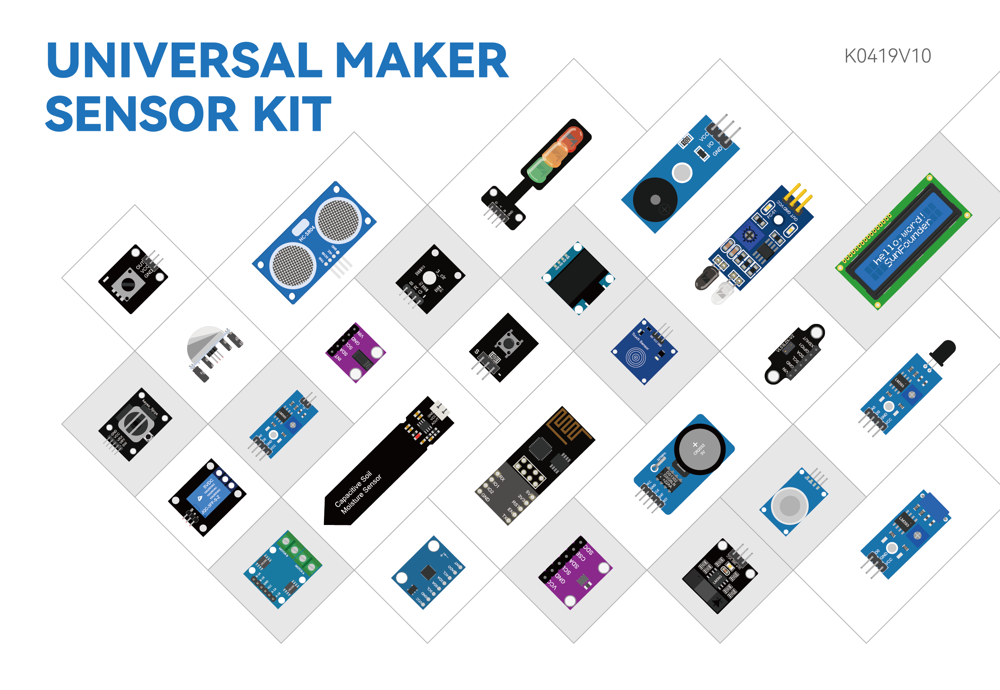

.. note:: 

    ¡Hola, bienvenido a la Comunidad de Entusiastas de SunFounder Raspberry Pi, Arduino y ESP32 en Facebook! Profundiza más en Raspberry Pi, Arduino y ESP32 junto con otros entusiastas.

    **¿Por qué unirte?**

    - **Soporte experto**: Resuelve problemas postventa y desafíos técnicos con la ayuda de nuestra comunidad y equipo.
    - **Aprender y compartir**: Intercambia consejos y tutoriales para mejorar tus habilidades.
    - **Preestrenos exclusivos**: Obtén acceso anticipado a nuevos anuncios de productos y adelantos.
    - **Descuentos especiales**: Disfruta de descuentos exclusivos en nuestros productos más recientes.
    - **Promociones festivas y sorteos**: Participa en sorteos y promociones de temporada.

    👉 ¿Listo para explorar y crear con nosotros? Haz clic en [|link_sf_facebook|] y únete hoy mismo!

|link_Universal_kit|
==================================================

* |link_Universal_Maker_Sensor_Kit|

Gracias por elegir nuestro |link_Universal_kit|.

 .. note::
     Este documento está disponible en los siguientes idiomas.

         * |link_german_tutorials|
         * |link_jp_tutorials|
         * |link_en_tutorials|
         * |link_fr_tutorials|
         * |link_es_tutorials|
         * |link_it_tutorials|
    

     Por favor, haz clic en los enlaces correspondientes para acceder al documento en el idioma de tu preferencia.

¿Alguna vez has pedido un kit electrónico en línea, solo para descubrir que venía con un PDF básico o un folleto limitado que apenas toca la superficie del potencial de tu proyecto? ¿O estás ansioso por construir tus propios dispositivos inteligentes pero te sientes intimidado por la complejidad y los altos costos de los kits disponibles? Tal vez has admirado los proyectos avanzados que otros han creado, pero no sabías por dónde empezar.

Presentamos nuestro "Universal Maker Sensor Kit" – la solución a todos estos desafíos y la puerta de entrada para dominar la electrónica moderna.

Dentro del Universal Maker Sensor Kit, encontrarás una amplia gama de componentes, desde protoboards básicas hasta sensores complejos como detectores de llamas, sensores de gas, y mucho más – más de 25 sensores, actuadores y módulos de visualización en total. Cada componente viene con un tutorial fácil de seguir que es compatible con Arduino Uno, módulos ESP32, Raspberry Pi Pico y Raspberry Pi, haciendo que tu proceso de aprendizaje sea fluido y envolvente.

Nuestro kit es completamente compatible con la última serie de Arduino UNO, el UNO R4, así como con la última versión de Raspberry Pi, el Raspberry Pi 5, asegurando que te mantengas a la vanguardia de los avances tecnológicos. Ya seas un principiante o un maker experimentado, nuestro kit puede mejorar tus habilidades mediante componentes de última generación.

Este kit no se trata solo de ensamblar piezas; se trata de liberar tu creatividad. Aprenderás a escribir tu propio código, desarrollar proyectos únicos y comprender las complejidades de cada componente. Ya seas un principiante o un maker experimentado, nuestro kit está diseñado para elevar tus habilidades en electrónica.

Y para aquellos que recién comienzan, ofrecemos una variedad de proyectos atractivos, perfectos para iniciarse en el mundo de la programación y la electrónica. Ganarás el conocimiento y la confianza para progresar de principiante a experto, creando tus propios dispositivos inteligentes y proyectos electrónicos.

Sumérgete en el mundo de la innovación electrónica hoy con nuestro Universal Maker Sensor Kit. ¡Convierte tus ideas en realidad y evoluciona de principiante a experto en el campo de la electrónica y la programación!

Si tienes alguna pregunta o ideas interesantes, no dudes en enviarnos un correo electrónico a service@sunfounder.com.

.. * :ref:`Sobre el idioma de visualización`

* :ref:`Índice de contenidos`

* :ref:`Aviso de derechos de autor`

.. Sobre el idioma de visualización
.. ----------------------------------

.. .. note::

..     Además del inglés, estamos trabajando en otros idiomas para este curso. 
..     Por favor, contacta a service@sunfounder.com si estás interesado en ayudar, 
..     y te daremos un producto gratis a cambio. 

.. Actualmente, el tutorial en línea está disponible en inglés, alemán y japonés. Haz clic en el icono **Leer los Documentos** en la esquina inferior izquierda de la página para cambiar el idioma de visualización.

.. .. image:: img/translation.png
..     :align: center

.. .. raw:: html

..      

Índice de contenidos
--------------------------------

.. toctree:: 
    :maxdepth: 2

    About Universal Maker Sensor Kit <self>
    download_code
    01_components_basic/00-component_list
    02_arduino/arduino
    03_esp32/esp32
    04_pi_pico/pi_pico
    05_raspberry_pi/raspberry_pi
    06_faq/00_faq
    07_appendix/appendix
    thank-learning

Aviso de derechos de autor
-----------------------------

Todo el contenido, incluyendo pero no limitado a textos, imágenes y códigos en este manual, es propiedad de SunFounder Company. Debes usarlo solo para estudio personal, investigación, disfrute u otros fines no comerciales o sin fines de lucro, bajo las regulaciones y leyes de derechos de autor correspondientes, sin infringir los derechos legales del autor y otros titulares de derechos relevantes. Cualquier persona o entidad que utilice estos contenidos con fines comerciales sin autorización, la empresa se reserva el derecho de emprender acciones legales.
